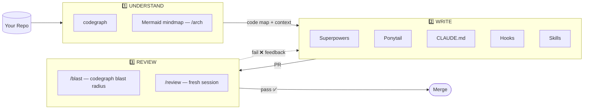
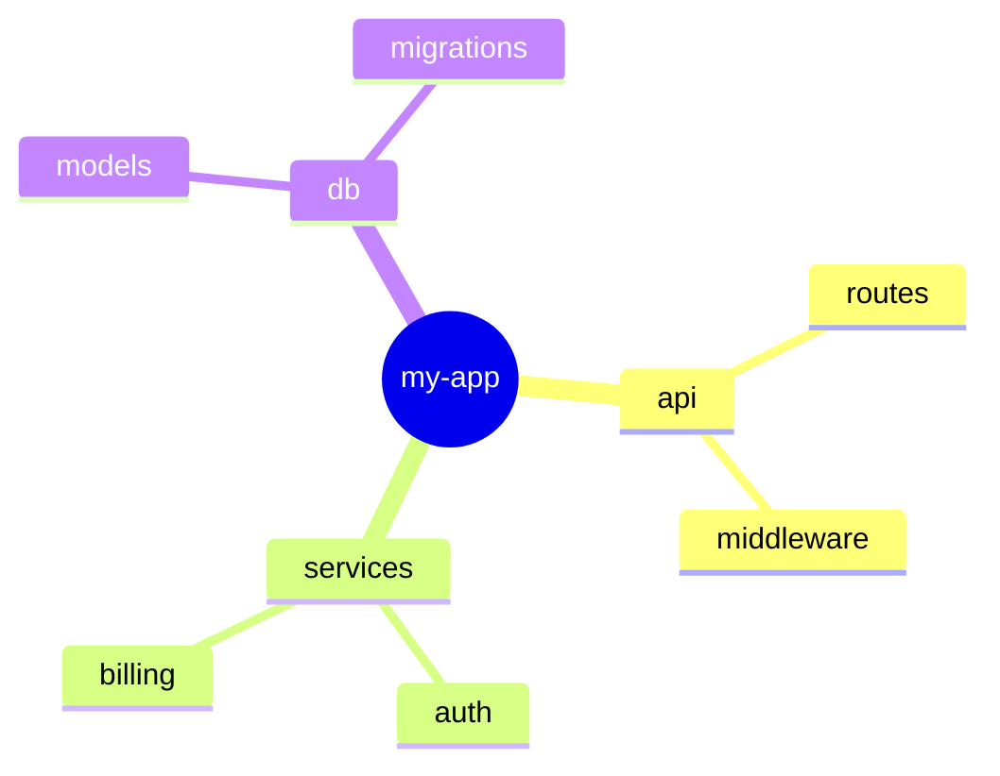
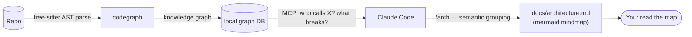
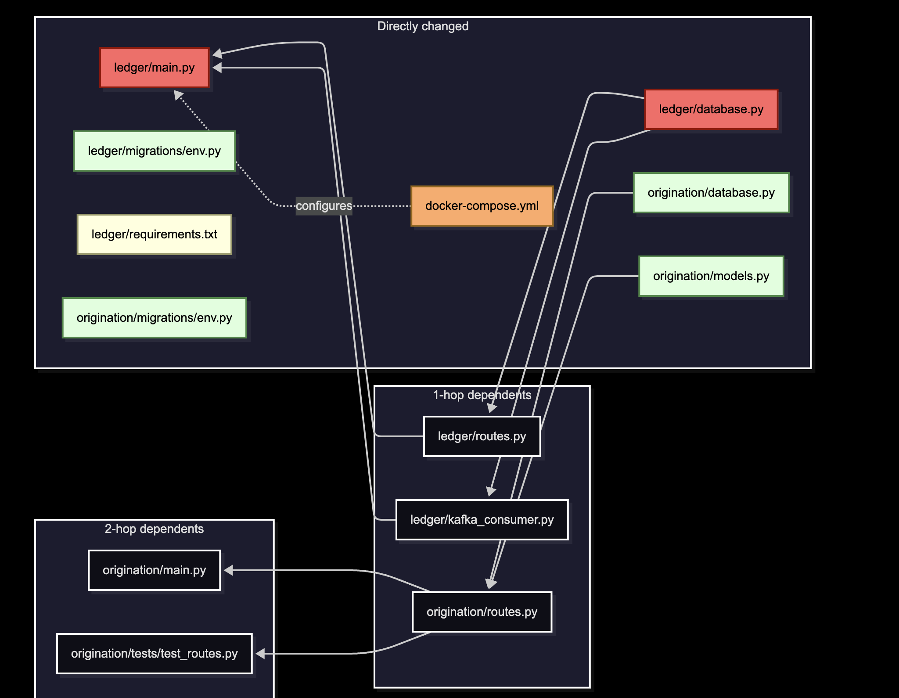
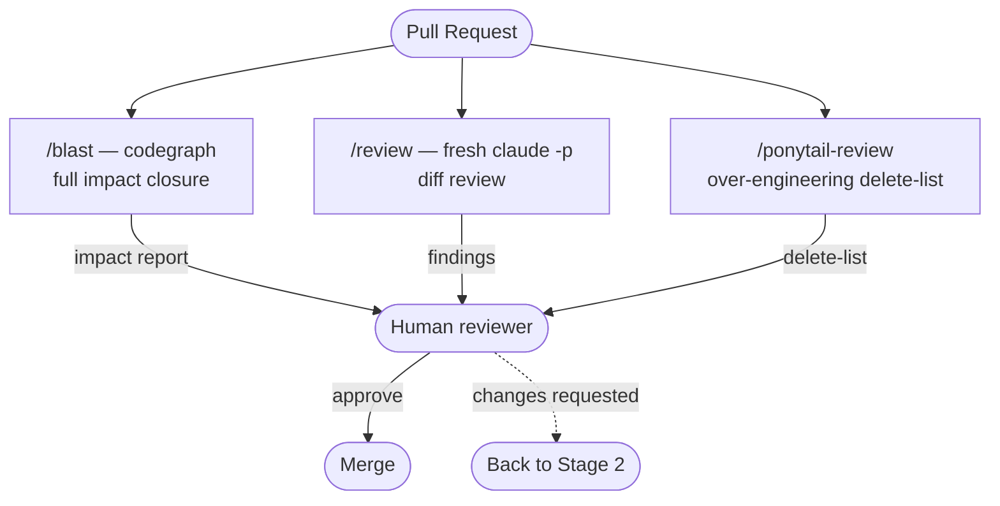

# AI Dev Workflow: Understand → Write → Review

Everyone debates which AI agent codes best. The real gap is the workflow *around* the agent. Here's mine — all open source, all BYOK.


## The big picture



---

## Stage 1: Understand the code first

### 🗺️ codegraph
- **What:** Parses your repo with tree-sitter (20+ languages) into a queryable knowledge graph. Runs local, one `npx` command.
- **Solves:** Agent editing code it doesn't understand — the #1 source of bad AI code.
- **How it helps:** Exposes the graph over MCP → Claude Code asks "who calls this? what breaks if I change it?" and gets AST-accurate answers, not guesses. One graph powers all three stages: understanding here, reuse checks while writing, blast radius at review.

### 🧠 Mermaid mindmap — `/arch`
- **What:** One command turns the graph into a visual map of the architecture — modules, responsibilities, data flow, grouped semantically.
- **Solves:** Graphs are precise but unreadable; mindmaps are readable but usually inaccurate. This gives you both.
- **How:** run `/arch` in Claude Code → regenerates `docs/architecture.md` (GitHub and VS Code render the mermaid block natively).



### Stage 1 — LLD



---

## Stage 2: Write code properly

### 📋 Superpowers
- **What:** Skill library that forces brainstorm → plan → implement.
- **Solves:** The agent confidently building the wrong thing.
- **How:** Plan is written down *before* any file is touched. You review it.

### 💇 Ponytail
- **What:** Makes your agent "the laziest senior dev in the room."
- **Solves:** Over-engineering. Ask for a date picker → bare agent installs flatpickr + wrapper + stylesheet. Ponytail: `<input type="date">`.
- **How:** A 7-rung ladder before writing anything: *need to exist? → already in codebase? → stdlib? → native? → installed dep? → one line? → minimum that works.*
- **Numbers:** ~54% less code, ~20% cheaper, ~27% faster — safety guards never cut.

### 📌 CLAUDE.md
- **What:** One file at repo root, loaded every session: stack, commands, conventions, gotchas.
- **Solves:** Agent re-learning your project every single session.
- **Rule:** If a line matters only 10% of the time, it doesn't belong here. Short and dense.

### 🔗 Code graph over MCP
- **What:** Same graph from Stage 1, wired in while writing.
- **Solves:** Ponytail's rung #2 ("already in this codebase?") working blind.
- **How:** Agent *queries* what exists instead of guessing → real reuse, safe refactors.

### ⚙️ Hooks
- **What:** Auto-run lint / typecheck after every edit; block bad commits.
- **Solves:** Prompts are suggestions; hooks are enforcement.
- **Rule:** Anything you'd never want skipped → hook, not prompt.

### 🧩 Skills
- **What:** On-demand knowledge files — loaded only when the task matches.
- **Solves:** Context bloat. CLAUDE.md = always-on facts; skills = procedures used sometimes.
- **Rule:** CLAUDE.md section grows past ~10 lines or applies only sometimes → extract to a skill.

> **🧭 The mental model — CLAUDE.md vs Skills**
> `CLAUDE.md` answers *"where am I?"* — it lives **with the code** (root always; drop one inside any folder for area-specific context, loaded only when the agent works there) and triggers **by location**.
> Skills answer *"how do I do this task?"* — they live in **one central place** (`.claude/skills/` = team, `~/.claude/skills/` = personal) and trigger **by task match** against their description.
> Location-triggered vs task-triggered — that's the entire architecture.

**The loop:** Superpowers plans → graph informs → Ponytail constrains → hooks enforce.

### Stage 2 — LLD


---

## Stage 3: Review — author ≠ examiner

An agent reviewing its own code just verifies its own assumptions — so review runs through three commands, each independent of the session that wrote the code:

- **`/blast [paths]`** — the blast radius, human-viewable: hop-sorted table of every changed symbol's full dependency closure + a mermaid graph (changed vs impacted marked, cross-service/MFE edges dashed = inferred) + untested nodes + risk paragraph → saved as a timestamped snapshot in `docs/blast/`.
- **`/review`** — pipes the diff to a **fresh `claude -p` instance** (no memory of the author session) and relays findings: bugs, edge cases, violated invariants, with file:line.
- **`/ponytail-review`** — the opposite class of problem: code that shouldn't exist. Hands back a delete-list.





### Stage 3 — LLD



---

## How to use each tool day-to-day

| Tool | Fires | How you actually use it |
|---|---|---|
| **CLAUDE.md** | Auto (by location) | Loaded every session — your only job is keeping it truthful |
| **codegraph** (MCP) | Auto (agent queries it) | Claude Code consults it while working; ask explicitly anytime: *"who calls X? what breaks if I change Y?"* |
| **Architecture map** | `/arch` | Regenerates the mermaid mindmap from codegraph → `docs/architecture.md` (renders on GitHub) |
| **Superpowers** | Auto (task match) | Fires on non-trivial implementation tasks; force it anytime: *"brainstorm and plan before coding"* |
| **Ponytail** | Auto (always-on) | Constrains every coding task once installed — nothing to invoke. `/ponytail lite` to soften, `/ponytail full` to restore |
| **Skills** | Auto (task match) | Fire when the task matches their description; invoke by name if one doesn't trigger |
| **Blast radius** | `/blast [paths]` | Full dependency closure of your diff, hop-sorted + mermaid → `docs/blast/<date>-<time>-blast.md` (new snapshot per run) |
| **Fresh review** | `/review` | Pipes the diff to a fresh `claude -p` instance — findings from a session with no author bias |

**A full local review, in three commands (all inside Claude Code):**

```
/blast              # 1. blast radius → timestamped snapshot in docs/blast/
/review             # 2. fresh-instance diff review
/ponytail-review    # 3. over-engineering check
```

Everything above runs locally — blast radius included.

---

## TL;DR

| Stage | Job | Tool |
|---|---|---|
| Understand | Code map | codegraph |
| Understand | Visual picture | `/arch` → docs/architecture.md |
| Write | Plan first | Superpowers |
| Write | Minimal code | Ponytail |
| Write | Project context | CLAUDE.md |
| Write | Codebase awareness | Code graph MCP |
| Write | Enforcement | Hooks |
| Write | Procedures | Skills |
| Review | Blast radius | `/blast` → docs/blast/ |
| Review | Quality | `/review` — fresh claude -p |

All open source. One graph tool. Weekend setup. The agent didn't get smarter — the workflow did.

---

## Setup

**Prerequisites:** Claude Code (logged in), Node 18+, Python 3.10+, git.

Open Claude Code in the repo you want to equip and paste:

> *Fetch https://raw.githubusercontent.com/codeshivamsi-sketch/ai_dev_workflow/main/setup.sh, show me a summary of what it will do, then run it. For any step that fails or prints a [manual] warning, find that tool's official install docs, install it the current correct way for my OS, and verify it works. When the script finishes: (1) analyze this codebase and fill every `<blank>` in CLAUDE.md from what you actually find; (2) run the hook command in `.claude/settings.json` once and fix it if it fails. Show me both files for approval before saving. Ask me before anything that needs sudo.*

Restart Claude Code, approve the MCP prompt, commit `CLAUDE.md`, `.claude/`, `.mcp.json`. Done — try `/arch`, `/blast`, `/review`.

---

## Bonus

### 🧪 Integration tests

1. Ask, naming the flows: *"Write integration tests for checkout: valid card → order created, stock decremented; expired card → 402, no order row."*
2. Claude lists the test cases as names — approve or edit the list (your 2-minute gate).
3. It builds the env (real DB via testcontainers), writes the tests, runs to green. New feature? It confirms they fail first.

The rules live in `.claude/skills/integration-test/SKILL.md` (installed by setup) — they load automatically whenever you ask for tests. Nothing runs on its own.

### 📚 Docs the agent can read

Don't document what code already says — Claude derives structure, call chains, and behavior from the code itself; only write down what it can't infer: the *why*, invariants, and intent.

| Doc | Where | When | How |
|---|---|---|---|
| CLAUDE.md | repo root | once, at project start | setup has Claude draft it from your code; you approve |
| ADR | `docs/adr/NNNN-title.md` | the moment a decision is made — never retroactively | `/adr` skill drafts it; you approve. Immutable once merged |
| Architecture map | `docs/architecture.md` | anytime | `/arch` — generated from the graph, can't go stale |
| Module README | `src/<module>/README.md` | only where intent isn't obvious | 5 lines: *owns / never does / depended on by* |
| Strict types | everywhere | always | `Money`, not `number` — the typecheck hook enforces them |
