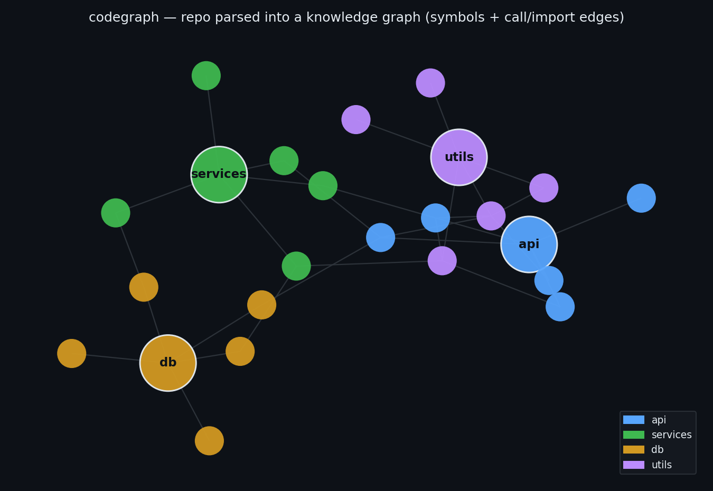
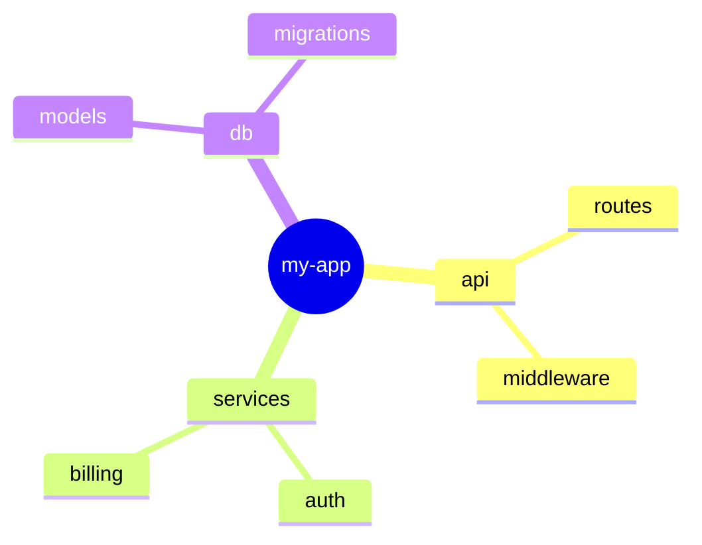
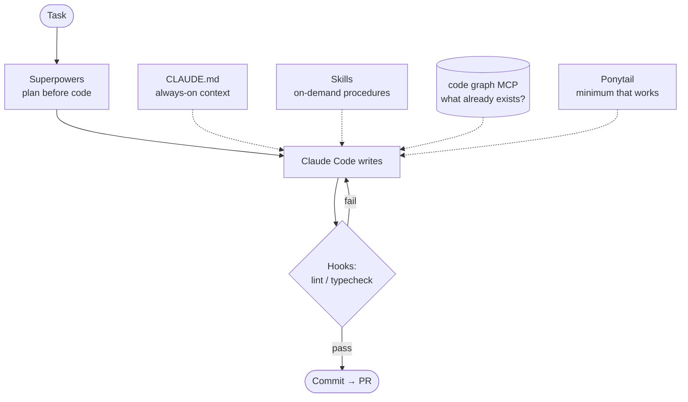

# AI Dev Workflow: Understand → Write → Review

Everyone debates which AI agent codes best. The real gap is the workflow *around* the agent. Here's mine — all open source, all BYOK.


## The big picture


---

## Stage 1: Understand the code first

### 🗺️ codegraph
- **What:** Parses your repo with tree-sitter (20+ languages) into a queryable knowledge graph. Runs local, one `npx` command.
- **Solves:** Agent editing code it doesn't understand — the #1 source of bad AI code.
- **How it helps:** Exposes the graph over MCP → Claude Code asks "who calls this? what breaks if I change it?" and gets AST-accurate answers, not guesses. One graph powers all three stages: understanding here, reuse checks while writing, blast radius at review.



### 🧠 Mermaid mindmap — `/arch`
- **What:** One command turns the graph into a visual map of the architecture — modules, responsibilities, data flow, grouped semantically.
- **Solves:** Graphs are precise but unreadable; mindmaps are readable but usually inaccurate. This gives you both.
- **How:** run `/arch` in Claude Code → regenerates `docs/architecture.md` (GitHub and VS Code render the mermaid block natively).



### Stage 1 — LLD


---

## Stage 2: Write code properly

### 📋 Superpowers
- **What:** Skill library that forces brainstorm → plan → implement.
- **Solves:** The agent confidently building the wrong thing.
- **How:** Plan is written down *before* any file is touched. You review it.

### 💇 Ponytail
- **What:** Makes your agent "the laziest senior dev in the room."
- **Solves:** Over-engineering. Ask for a date picker → bare agent installs flatpickr + wrapper + stylesheet. Ponytail: `<input type="date">`.
- **How:** A 7-rung ladder before writing anything: *need to exist? → already in codebase? → stdlib? → native? → installed dep? → one line? → minimum that works.*
- **Numbers:** ~54% less code, ~20% cheaper, ~27% faster — safety guards never cut.


### 📌 CLAUDE.md
- **What:** One file at repo root, loaded every session: stack, commands, conventions, gotchas.
- **Solves:** Agent re-learning your project every single session.
- **Rule:** If a line matters only 10% of the time, it doesn't belong here. Short and dense.

### 🔗 Code graph over MCP
- **What:** Same graph from Stage 1, wired in while writing.
- **Solves:** Ponytail's rung #2 ("already in this codebase?") working blind.
- **How:** Agent *queries* what exists instead of guessing → real reuse, safe refactors.

### ⚙️ Hooks
- **What:** Auto-run lint / typecheck after every edit; block bad commits.
- **Solves:** Prompts are suggestions; hooks are enforcement.
- **Rule:** Anything you'd never want skipped → hook, not prompt.

### 🧩 Skills
- **What:** On-demand knowledge files — loaded only when the task matches.
- **Solves:** Context bloat. CLAUDE.md = always-on facts; skills = procedures used sometimes.
- **Rule:** CLAUDE.md section grows past ~10 lines or applies only sometimes → extract to a skill.

> **🧭 The mental model — CLAUDE.md vs Skills**
> `CLAUDE.md` answers *"where am I?"* — it lives **with the code** (root always; drop one inside any folder for area-specific context, loaded only when the agent works there) and triggers **by location**.
> Skills answer *"how do I do this task?"* — they live in **one central place** (`.claude/skills/` = team, `~/.claude/skills/` = personal) and trigger **by task match** against their description.
> Location-triggered vs task-triggered — that's the entire architecture.

**The loop:** Superpowers plans → graph informs → Ponytail constrains → hooks enforce.

### Stage 2 — LLD



---

## Stage 3: Review — author ≠ examiner

An agent reviewing its own code just verifies its own assumptions. Review must be independent.

### 💥 Code blast — same codegraph, `/blast` command
- **What:** One command traces every changed **symbol** in your diff and its complete dependency closure — callers, importers, inheritors — with no depth limit, hop counts included.
- **Solves:** "This PR touches 3 files" hiding "…and impacts 40 more." Symbol-level, not file-level: a one-line change doesn't taint every symbol in the file.
- **How:** `/blast` (analyzes `git diff main`) or `/blast src/payments/` for specific paths. Output: a hop-sorted dependents table, a mermaid flowchart of the closure (changed vs impacted marked), untested nodes, and a plain-language risk assessment — saved as a timestamped snapshot in `docs/blast/`.


### 🔍 Claude as the reviewer — `/review` command
- **What:** `/review` pipes your diff to a **fresh** `claude -p` instance and relays its findings:
```bash
  git diff main | claude -p "Review this diff: bugs, edge cases, violated invariants from CLAUDE.md and docs/adr/"
```
- **Why the command spawns a separate instance:** the session that *wrote* the code must never be the session that *reviews* it — a fresh instance carries none of the author's assumptions, which is the entire point of review. The command deliberately runs the review in a new `claude -p` process, not in your current session.
- **Bonus:** run `/ponytail-review` on the same diff for the opposite class of problem — code that shouldn't exist. Claude finds bugs; Ponytail hands back a delete-list.

### Stage 3 — LLD


---

## How to use each tool day-to-day

| Tool | Fires | How you actually use it |
|---|---|---|
| **CLAUDE.md** | Auto (by location) | Loaded every session — your only job is keeping it truthful |
| **codegraph** (MCP) | Auto (agent queries it) | Claude Code consults it while working; ask explicitly anytime: *"who calls X? what breaks if I change Y?"* |
| **Architecture map** | `/arch` | Regenerates the mermaid mindmap from codegraph → `docs/architecture.md` (renders on GitHub) |
| **Superpowers** | Auto (task match) | Fires on non-trivial implementation tasks; force it anytime: *"brainstorm and plan before coding"* |
| **Ponytail** | Auto (always-on) | Constrains every coding task once installed — nothing to invoke. `/ponytail lite` to soften, `/ponytail full` to restore |
| **Skills** | Auto (task match) | Fire when the task matches their description; invoke by name if one doesn't trigger |
| **Blast radius** | `/blast [paths]` | Full dependency closure of your diff, hop-sorted + mermaid → `docs/blast/<date>-<time>-blast.md` (new snapshot per run) |
| **Fresh review** | `/review` | Pipes the diff to a fresh `claude -p` instance — findings from a session with no author bias |

**A full local review, in three commands (all inside Claude Code):**

```
/blast              # 1. blast radius → timestamped snapshot in docs/blast/
/review             # 2. fresh-instance diff review
/ponytail-review    # 3. over-engineering check
```

Everything above runs locally — blast radius included.

---

## TL;DR

| Stage | Job | Tool |
|---|---|---|
| Understand | Code map | codegraph |
| Understand | Visual picture | `/arch` → docs/architecture.md |
| Write | Plan first | Superpowers |
| Write | Minimal code | Ponytail |
| Write | Project context | CLAUDE.md |
| Write | Codebase awareness | Code graph MCP |
| Write | Enforcement | Hooks |
| Write | Procedures | Skills |
| Review | Blast radius | `/blast` → docs/blast/ |
| Review | Quality | `/review` — fresh claude -p |

All open source. One graph tool. Weekend setup. The agent didn't get smarter — the workflow did.

---

## Setup

No cloning, no copying files. The script creates everything.

### Prerequisites

- **Claude Code** installed and logged in (Pro/Max or API key)
- **Node 18+**, **Python 3.10+**, **git**

### Install — one prompt, any repo

Open Claude Code **in the repo you want to equip** (new or existing) and paste:

> *Fetch https://raw.githubusercontent.com/codeshivamsi-sketch/ai_dev_workflow/main/setup.sh, show me a summary of what it will do, then run it. For any step that fails or prints a [manual] warning, find that tool's official install docs, install it the current correct way for my OS, and verify it works. When the script finishes: (1) analyze this codebase and fill every `<blank>` in CLAUDE.md — stack, commands, conventions, invariants, gotchas — from what you actually find; (2) run the hook command in `.claude/settings.json` once and fix it if it fails. Show me both files for approval before saving. Ask me before anything that needs sudo.*

The script only creates files that don't exist — safe on brand-new and existing projects alike. Nothing gets overwritten. (This repo is the reference implementation; **Use this template** also works for greenfield projects.)

### How the script is organized

`setup.sh` is a thin orchestrator — it doesn't hold the prompts inline anymore. The repo is split so every piece is editable on its own:

```
setup.sh              # entry point: resolves its dir, runs the steps in order
lib/                  # one file per step
  common.sh           #   shared helpers: step/warn, copy-if-missing
  00-prereqs.sh … 07-summary.sh   # prereqs, codegraph, skills, commands, hooks, docs, summary
templates/            # every prompt/file the script writes, editable as plain files
  commands/{arch,blast,review}.md
  skills/{integration-test,adr}.SKILL.md
  claude-md.md, mcp.json, settings.json.tpl, docs/adr/0000-template.md
```

To change what `/blast` says or tweak the integration-test rules, edit the file under `templates/` — no bash involved. **The one-liner above still works unchanged:** when `setup.sh` is piped via `curl` (detached from `lib/` and `templates/`), it clones the repo to a temp dir and re-execs itself from there, so it always has its templates — you still don't clone anything by hand.

**What gets installed:**
- `~/.claude/skills/` → **Superpowers**, **Ponytail** (personal, all repos)
- Created in the repo if missing: `.mcp.json` (codegraph), `CLAUDE.md` (Claude fills the blanks from your code), hooks auto-wired to your detected lint/typecheck commands, the `integration-test` and `/adr` skills, the ADR template, and the **/arch**, **/blast**, **/review** slash commands in `.claude/commands/`

**What Claude will ask you during install:**
- Permission to run the script and individual commands (approve)
- Confirmation before anything needing `sudo`
- **Approval of the CLAUDE.md and hook config it filled in** — read these; it's the only judgment call in the whole setup

### Activate

1. Restart Claude Code in the repo → *"This project defines MCP servers — allow?"* → **approve**. codegraph is live.
2. Skim the CLAUDE.md Claude wrote — correct anything wrong, and keep the **Tool routing** block; it's what makes codegraph, /blast, and plan-first fire automatically instead of occasionally.
3. Commit `CLAUDE.md`, `.claude/`, and `.mcp.json` — teammates get the repo-level stack on clone.

### What fires on its own after this

| | |
|---|---|
| **Ponytail** | always-on — nothing to invoke |
| **Superpowers, skills** | task-match automatically; force with *"plan first"* / the skill's name |
| **codegraph** | agent queries it per the Tool routing block in CLAUDE.md |
| **/arch, /blast, /review** | manual — see "How to use each tool" above |

### Verify (30 seconds)

- Ask Claude Code to edit any file → the lint/typecheck hook runs
- Ask *"what calls X?"* → codegraph answers
- Run `/blast` → hop-sorted impact report lands as a timestamped file in `docs/blast/`

Done. ✅

### Where things run

Everything runs on your machine — understanding, writing, blast radius, review. *Author ≠ examiner* holds by **instance**, not machine: the Claude session that wrote the code is never the one that reviews it — `/review` spawns a fresh one.

---

## Bonus

Beyond the core loop — worth adopting once the basics are habitual.

### 🧪 Integration tests — Claude writes them

**What the script installed for you:** one file — `.claude/skills/integration-test/SKILL.md`. It contains the *rules* for writing good integration tests (assert outcomes not implementation; enumerate cases for approval first; red-before-green for new features; never weaken a failing test). Because it's a skill, those rules load automatically whenever you ask for tests. That's all the script does — no test framework, no CI job, nothing runs on its own.

**What you do:** ask for tests and name the flows. That's the entire interface:

```
Write integration tests for checkout:
- valid card → order row created, stock decremented
- expired card → 402, and no order row
```

**What happens next (the skill drives this):**

1. Claude enumerates test cases as *names only* — happy paths, edge cases, errors — and **waits for your approval.** This is your 2-minute review gate: scan the list, add what's missing ("you forgot: card declined mid-flow"), strike the over-engineered.
2. It builds the environment — real Postgres via testcontainers, seed data, teardown; only external third parties (Stripe, email) get mocked.
3. It writes the approved tests. For a **new** feature, it runs them first and confirms they **fail** — a test that passes before the code exists proves nothing.
4. It implements/fixes until green, and it may not delete or weaken a failing test to get there — it must flag it to you instead.

**Division of labor, in one line:** you supply the flows and the judgment (step 1's approval); the skill supplies the discipline; Claude supplies the labor. Without the skill, you'd paste the rules every time — with it, "write tests for X" is enough.

**Two things this deliberately does NOT do:**
- **Run tests automatically** — you initiate every run. If you want tests to run on every edit, that's a hook (add `npm test` to `.claude/settings.json`), a separate choice with a real cost: slow suites make every edit slow.
- **Decide what to test** — it will ask for flows if you don't name them. Naming the flows is the part that requires knowing your product; that stays yours.

---

### 📚 Docs the agent can read

The agent reads your *code* better than any human — so only document what code can't say. **Codegraph tells the agent what the code is; docs tell it why.**

**❌ Don't write — tools derive these, always fresh:**
- What functions do, call chains, structure → codegraph regenerates from the AST
- Line comments explaining *what* code does
- Exhaustive module wikis → they go stale, and stale docs are worse than none: the agent trusts them confidently and codes against a reality that no longer exists

**✅ Do write — no AST contains these:**
- **Why** — "polling, not websockets, because the client's proxy kills long-lived connections"
- **Invariants** — "orders are never deleted, only cancelled"
- **Intent boundaries** — what a module owns, and what it must never do
- **Entry point** — CLAUDE.md / AGENTS.md linking to all of the above
- **Tool routing** — when the agent should reach for which tool; auto-firing is only reliable if it's written down (see below)

**How · When · Where:**

| Doc | Where | When | How |
|---|---|---|---|
| CLAUDE.md | repo root | once, at project start | the setup prompt has Claude draft it from your code; you approve. Touch only when commands/conventions change |
| ADR | `docs/adr/NNNN-title.md` | the moment a real decision is made — never retroactively | the `/adr` skill drafts it from the planning session; you approve. Immutable once merged |
| Architecture map | `docs/architecture.md` | regenerate anytime | `/arch` — generated from the graph, so it can't go stale |
| Module README | `src/<module>/README.md` | only where intent isn't obvious from the name | 5 lines max: *owns / never does / depended on by* |
| Strict types | everywhere | always | `Money`, not `number` — types are docs the typecheck hook already enforces |

**Make auto-firing reliable — the Tool routing block in CLAUDE.md** (the setup script includes it):

```markdown
## Tool routing
- Before creating any new function or utility: query codegraph — does it already exist?
- Before refactoring anything shared: run /blast on the affected files
- Any non-trivial feature: plan first (Superpowers)
```

**Rule of thumb:** document what changes *rarely* (decisions, invariants); let tools derive what changes *often* (structure, call graphs). Docs written at decision time can't go stale — they record a moment, not the present.
